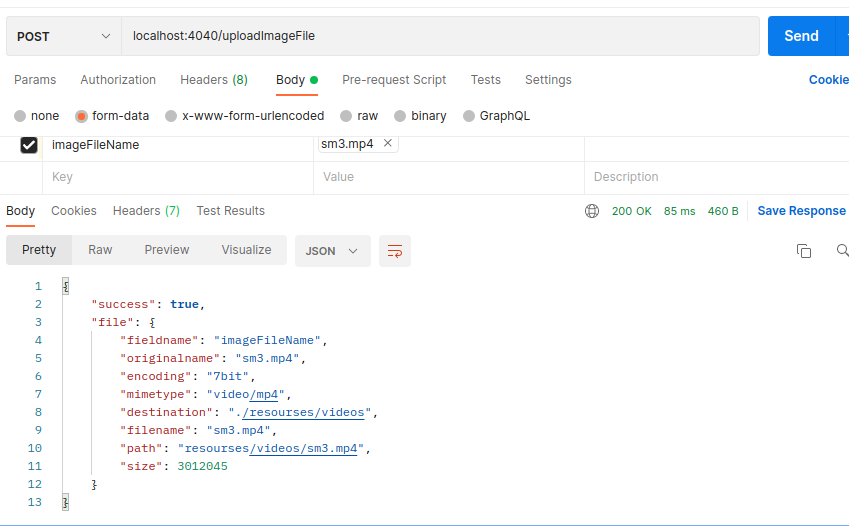
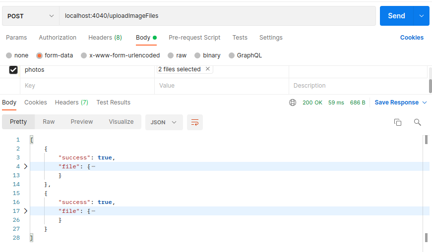

# nodeFileUpload

We can upload audio,video and image files whether single or multiple as long as file size constraint is not violated .
here we use npm multer nodule for file uploading 

### 01. Single File Upload.

### 02. Multiple File Upload.

